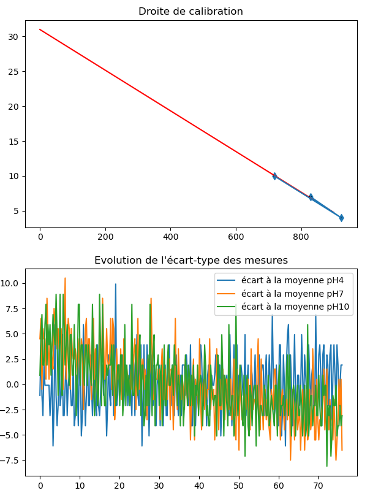

.. _calibration:

Calibration du pH mètre
=======================

Pour une meilleure exactitude, un étalonnage fréquent de l’instrument est recommandé. Un étalonnage
est indispensable dans les cas suivants :

• L’électrode a été remplacée
• Au moins une fois par mois
• Après avoir mesuré des produits chimiques agressifs
• Lorsqu’une grande exactitude est requise

Préparation
-----------

Versez une petite quantité de solution **pH 7,00** et **pH 4,00** dans deux récipients propres. Pour une
meilleure exactitude, il est conseillé de prendre deux récipients par solution, un récipient pour le rinçage et un autre pour
l’étalonnage à proprement dit. Le choix des solutions étalons se fait selon l’utilisation, soit **pH 7,00** et
**pH 4,00** dans le cas d’une calibration à deux tampons et **pH 10,00**, **pH 7,00** et **pH 4,00** dans le cas d’une
calibration à trois tampons.

Procédure
---------

Calibration à deux solutions tampons
~~~~~~~~~~~~~~~~~~~~~~~~~~~~~~~~~~~~

Ôtez le capuchon de protection en bout de la sonde pH, **rincez** celle-ci avec de l’eau distillée puis immergez l’électrode 
dans une solution **pH 7,00** ; agitez délicatement pendant quelques secondes ; immergez la sonde de température 
et **attendez 2 à 3 minutes** pour avoir un équilibre thermique correct.

Choisissez dans le menu interface l’option ``Calibrer`` en appuyant sur le chiffre ``1`` et en validant avec
la touche **Entrée**::

    ===========================================================================
    MENU PRINCIPAL
    ===========================================================================
    Que souhaitez-vous faire ?
    1 - Calibrer
    2 - Mesurer
    3 - Représenter graphiquement
    4 - Quitter
    ===========================================================================
    ?

    -> 1

        ===========================================================================
        MENU CALIBRATION
        ==========================================================================
        Voulez - vous :
        1 - Calibrer avec deux tampons (pH 7 et 4) ?
        2 - Calibrer avec trois tampons (pH 7, 4 et 10) ?
        3 - Calibrer à partir d'une calibration déjà existante dans le répertoire
        4 - Quitter le menu calibration et retourner au menu principal
        ===========================================================================
        ? 

Sélectionnez ensuite l’option ``Calibrer avec deux tampons`` de la même façon. 
Validez une seconde fois lorsque vous serez prêt à mesurer le tampon à
**pH 7,00**. Le programme vous demandera alors de patienter **une minute** le temps que la sonde pH se
stabilise puis effectuera **100 mesures** pour une durée approximative de **deux minutes**.

Une fois les mesures à **pH 7,00** effectuées, **rincez** la sonde pH avec de l’eau distillée.

Plongez l’électrode dans la solution **pH 4,00** et attendez quelques minutes pour la stabilisation de la
mesure. Une fois prêt à mesurer le tampon à pH 4,00, appuyez sur la touche **Entrée** pour initier les
mesures. Comme plus tôt, le programme vous demandera alors de patienter **1 minute** le temps que la sonde pH
se stabilise puis effectuera ses **100 mesures**.

Une fois les mesures effectuées, le programme vous demandera::
    
    ’Voulez-vous visualiser la calibration (O/N) ?’

En répondant ``O``, ``o``, ``Y`` ou ``y``, vous obtiendrez alors la courbe d'étalonnage de la calibration
que vous venez d'effectuer, ses paramètres et le coefficient de corrélation. L'étalonnage est alors terminé, vous pouvez passer  
à vos :ref:`mesure`.

Si le programme juge que la calibration n’est pas satisfaisante **(R2 < 0.95)**, il vous sera proposé de
recalibrer votre pH-mètre. 
Si vous souhaitez recalibrer le pH-mètre, choisissez l'option ``1``. 
Si vous souhaitez continuer ainsi et commencer à mesurer, choisissez l'option ``2``.

Calibration à trois solution tampons
~~~~~~~~~~~~~~~~~~~~~~~~~~~~~~~~~~~~

Si vous souhaitez calibrer votre pH-mètre avec **3 solutions tampons** la procédure est la même mais il vous faudra
continuer avec la solution **pH 10,00**. 
Pour cela, choisissez dans l'interface ``MENU CALIBRATION`` l'option ``2 - Calibrer avec trois
tampons``::

    ===========================================================================
    MENU CALIBRATION
    ==========================================================================
    Voulez - vous :
    1 - Calibrer avec deux tampons (pH 7 et 4) ?
    2 - Calibrer avec trois tampons (pH 7, 4 et 10) ?
    3 - Calibrer à partir d'une calibration déjà existante dans le répertoire
    4 - Quitter le menu calibration et retourner au menu principal
    ===========================================================================
    ? 
    
    -> 2

    Quel est le pH de la troisième solution que vous souhaitez utilisez ? ( 9 / 10 / 11)

    -> 10

    Prêt pour calibration pH7 ?

    Patientez 1 min le temps que la sonde se stabilise

    Les mesures commencent

    La température relevée est de 25.91732608695652

    Prêt pour calibration pH4 ?

    Patientez 1 min le temps que la sonde se stabilise

    Les mesures commencent

    La température relevée est de 25.974727592267133

    Prêt pour calibration pH10 ?

    Patientez 1 min le temps que la sonde se stabilise

    Les mesures commencent

    La température relevée est de 26.36460258780037

    Les paramètres a et b de notre regression linéaire sont [-2.91457992e-02  3.09806410e+01]
    ('r2 =', 0.9974)

    Voulez-vous visualiser la calibration (O/N) ?

Les données de la calibration effectuée sont enregistrées dans le dossier ``CALIB``.

.. note::
    Si vous ne possédez pas de solution tampon pH 10 la calibration à 3 solutions est aussi possible avec des pH 9 et pH 11. Le programme vous demande pour cela::

        Quel est le pH de la troisième solution que vous souhaitez utilisez ? ( 9 / 10 / 11)
    
    Il suffit alors de renseigner la valeur pH de la troisième solution tampon utilisée et la procédure est la même que décrite plus haut.

Calibration à partir de données enregistrées
~~~~~~~~~~~~~~~~~~~~~~~~~~~~~~~~~~~~~~~~~~~~

Il est aussi possible de calibrer votre pH-mètre à partir de données de précédentes calibrations déja répertoriées dans le dossier ``CALIB``. 
Pour cela, choisissez dans le ``MENU CALIBRATION`` l’option ``3 - Calibration à partir d’une calibration déjà exitante dans le répertoire``. 
Une liste de fichier vous est proposée de la forme::

    ===========================================================================
    MENU CALIBRATION
    ==========================================================================
    Voulez - vous :
    1 - Calibrer avec deux tampons (pH 7 et 4) ?
    2 - Calibrer avec trois tampons (pH 7, 4 et 10) ?
    3 - Calibrer à partir d'une calibration déjà existante dans le répertoire
    4 - Quitter le menu calibration et retourner au menu principal
    ===========================================================================
    ? 
    
    -> 3

    Cette option n'est possible que pour des calibrations à 3 solutions, quel est le pH de la troisième solution de la calibration que vous souhaitez utilisez ? ( 9 / 10 / 11)

    -> 10

    Calibrations disponibles:
    0 - ./CALIB/fichier_calibration_pH10.0 Mon Jun 23 11:46:13 2025.csv

    Choisissez votre calibration en entrant son numéro d'ordre: 
    
    -> 0

    Mon Jun 23 11:46:13 2025
    ./CALIB/fichier_calibration_pH4.01 Mon Jun 23 11:46:13 2025.csv
    ./CALIB/fichier_calibration_pH7.01 Mon Jun 23 11:46:13 2025.csv
    ./CALIB/fichier_calibration_pH10.0 Mon Jun 23 11:46:13 2025.csv

    Les paramètres a et b de notre regression linéaire sont [-2.91457992e-02  3.09806410e+01]
    ('r2 =', 0.9974)

Il suffit alors de renseigner le numéro d'ordre des données que vous souhaitez utiliser et valider avec la touche **Entrée**. 

.. note:: 

    Le fichier à sélectionner est de la forme ``./CALIB/fichier_calibration_pH10.00 Day Month H_min_sec Year.csv`` mais implicitement
    ceux correspondant à la même calibration pour les **pH 4.00** et **7.00** vont aussi être utilisé. Notez que si la calibration que vos souhaitez
    retrouver n'utilisait pas de solutions pH 10 mais pH 9 ou pH 11 le programme vous demande avant de lister les fichiers::

        Cette option n'est possible que pour des calibrations à 3 solutions, quel est le pH de la troisième solution de la calibration que vous souhaitez utilisez ? ( 9 / 10 / 11)

    Il vous suffit d'indiquer le pH de la troisième solution, tout les fichiers de calibration utilisant la solution au pH indiqué vont être listés. Une fois une 
    calibration sélectionnée les fichiers correspondant à la même calibration pour les **pH 4.00** et **7.00** le seront aussi implicitement.

Une fois le fichier renseigné la calibration sera effectuée, la droite de la calibration choisie apparaitra à
l’écran ainsi que la courbe de l’évolution de l’écart-type des mesures au cours du temps. 

Vous pouvez maintenant effectuer vos :ref:`mesure`. 

.. warning::

    Assurez-vous que les fichiers que vous renseignez correspondent au format demandé :
    un fichier ``csv``, avec pour chaque ligne les informations ``temps(s);température(°C);voltage(mV)``::
        
        0.00; 23.27; 180.00
        0.25; 23.33; 180.00
        0.51; 23.33; 180.00
        0.76; 23.33; 180.00
        1.02; 23.37; 180.00
        1.27; 23.40; 180.00
        1.52; 23.43; 180.00
        1.78; 23.43; 179.00
        2.03; 23.47; 180.00
        ...

    Par défaut cela correspond au format des données de :ref:`mesure`.