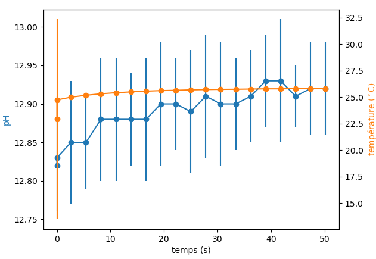

.. _graph:

Représentation graphique des données
====================================

.. warning::

    Que ce soit à l'issue de votre prise de vos :ref:`mesure` ou pour des données plus anciennes,
    lorsque ce vous souhaitez enregistrer votre figure, ne fermer la fenêtre affichée par le programme la contenant qu'une fois avoir sélectionné 
    l'option d'enregistrement::

        Sauver (O/N) ?

        -> O 
    
    Sinon vous n'enregistrerez qu'une page blanche.

Ce programme permet de représenter et d'enregistrer graphiquement les mesures
effectuées juste à l'instant ou lors de prises de mesures plus anciennes. 
Selectionnez pour cela l'option ``3 - Représenter graphiquement`` dans le ``MENU PRINCIPAL``. 

Le programme vous affichera la liste des données de mesures disponibles dans le dossier ``DATA``::

    ===========================================================================
    MENU PRINCIPAL
    ===========================================================================
    Que souhaitez-vous faire ?
    1 - Calibrer
    2 - Mesurer
    3 - Représenter graphiquement
    4 - Quitter
    ===========================================================================
    ? 

    -> 3

        fichiers disponibles:
        0 - ./DATA/fichier_mesure Thu Jun  6 12_58_56 2024.csv
        1 - ./DATA/fichier_mesure Thu Jun  6 12_03_47 2024.csv
        2 - ./DATA/fichier_mesure Thu Jun  6 12_52_02 2024.csv
        3 - ./DATA/fichier_mesure Thu Jun  6 12_04_58 2024.csv
        4 - ./DATA/fichier_mesure Thu Jun  6 12_14_54 2024.csv
        5 - ./DATA/fichier_mesure Fri Jun 28 11_19_49 2024.csv
        6 - ./DATA/fichier_mesure Fri Jun 28 11_27_36 2024.csv
        7 - ./DATA/fichier_mesure Thu Jun  6 12_46_56 2024.csv
        8 - ./DATA/fichier_mesure Fri Jun 28 11_21_37 2024.csv
        ...

Il suffit alors de renseigner le numéro d'ordre des données que vous souhaitez utiliser et valider avec la touche **Entrée**. 

Le graphique de vos données va s'afficher. Le programme va alors vous demander::

    Sauver (O/N) ?

Il est possible si vous le souhaitez d’enregistrer le graphique obtenu dans le dossier ``FIGURES``, il vous suffit alors de répondre avec les touches
``O``, ``o``, ``Y`` ou ``y``. 
Le fichier sera alors enregistré au format ``pdf`` dans le dossier ``FIGURES``. 